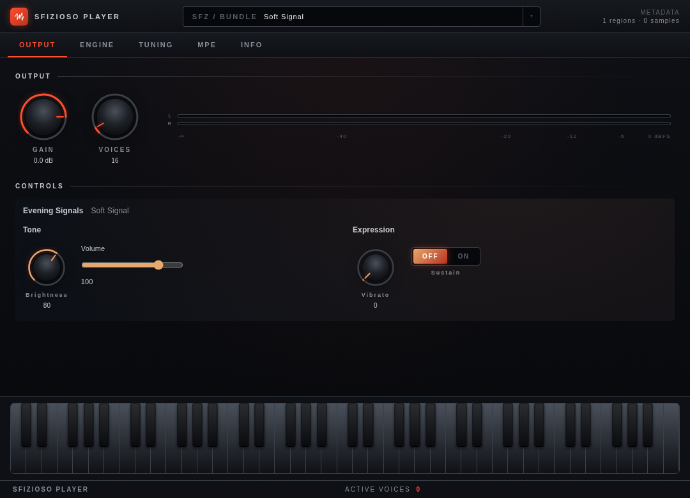
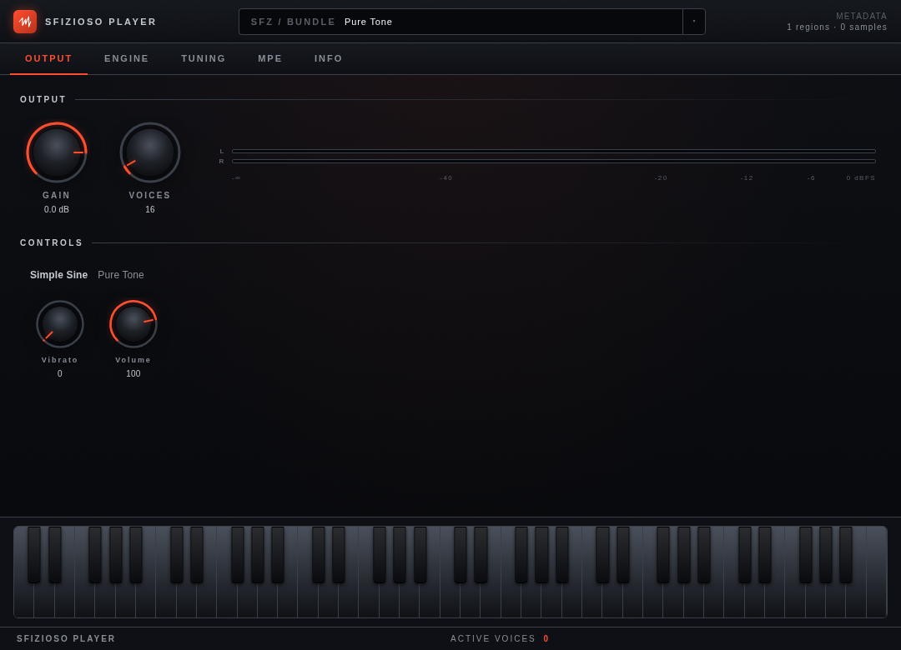

# Sfizioso Player

[](https://github.com/rullopat/sfizioso-player/actions/workflows/build.yml)

An open SFZ player (VST3 / AU / Standalone) and the shared foundation it is
built on, powered by the [sfizioso](https://github.com/rullopat/sfizioso) SFZ
engine — an independent, MPE-capable fork of sfizz.


## What's here

| Path | What | License |
|------|------|---------|
| `src/player_core/` | sfizioso engine wrapper (APVTS params, MIDI dispatch, render) | BSD-2-Clause |
| `src/instrument_manifest/` | bounded instrument metadata and asset helpers | BSD-2-Clause |
| `src/instrument_presentation/` | immutable presentation snapshots, safe artwork decoding and bridge DTOs | BSD-2-Clause |
| `src/core_prefs/`  | global user preference store (theme persistence) | BSD-2-Clause |
| `src/sfzbundle/`   | dependency-free `.sfzbundle` format and validated parser | BSD-2-Clause |
| `src/ui-shared/`   | React UI kit + C++/JS bridge (`juceBridge`, `useParam`, knobs, meters, design tokens) | BSD-2-Clause |
| `src/player/`      | the Sfizioso Player application (JUCE + React WebView editor) | AGPL-3.0 |

The shared libraries are permissive so they can also be consumed by other
projects (including closed-source ones); the application itself is AGPLv3.
See [LICENSE](LICENSE).

## Instrument presentation (v1 release candidate)

Give an SFZ instrument its own names, artwork, and organised controls with an
optional **`instrument.json`** file. The Player renders the presentation; the SFZ
continues to define the sound, MIDI mappings, and controller defaults.

Included in **1.0.0-rc.1**, a prerelease for compatibility testing before 1.0.0.
The release candidate is under review in [PR #8](https://github.com/rullopat/sfizioso-player/pull/8).
The discussion lives in
[issue #9](https://github.com/rullopat/sfizioso-player/issues/9).

### Try the examples

Open either example's **`instrument.sfz`** through **SFZ / BUNDLE**, or drag it
onto the Player. The Player discovers the sibling JSON automatically. Both
examples use built-in oscillators, so no sample downloads are needed.

**Evening Signals — authored controls and artwork.** Brightness and Vibrato are
knobs, Volume is a slider, and Sustain is a toggle. Tone and Expression are
named sections; the artwork and warm accent apply to the controls area.



[Open the example directory](examples/manifest-instrument/) ·
[Read its manifest](examples/manifest-instrument/instrument.json) ·
[Read its SFZ](examples/manifest-instrument/instrument.sfz)

**Simple Sine — names with default controls.** A minimal manifest supplies the
instrument and preset names. Without a `presentation` or `artwork` block, the
Player uses its theme and generates knobs from the SFZ's controller labels.



[Open the example directory](examples/manifest-minimal/) ·
[Read its manifest](examples/manifest-minimal/instrument.json) ·
[Read its SFZ](examples/manifest-minimal/instrument.sfz)

These screenshots show the built Player React UI with deterministic data from
the example files. The [capture script](tools/capture-manifest-examples.mjs)
documents how to reproduce them using a fixture-backed native bridge.

### Create your own instrument

Keep the manifest beside the SFZ, and keep any artwork inside that directory:

```text
MyInstrument/
├── instrument.sfz
├── instrument.json
└── artwork/
    └── background.png
```

Use the exact filename `instrument.json`. Set the preset's `sfz` field to the
loaded SFZ's filename, including case. For a loose SFZ, the Player only checks
its own directory; it does not search parent directories.

The smallest useful manifest is:

```json
{
  "format": "sfizioso.instrument-manifest",
  "formatVersion": 1,
  "instrument": { "name": "Simple Sine" },
  "presets": [
    { "id": "sine", "name": "Pure Tone", "sfz": "instrument.sfz" }
  ]
}
```

To customise the controls, add `presentation.sections` to a preset. This
complete example includes every supported field:

<!-- manifest-example:start -->
```json
{
  "format": "sfizioso.instrument-manifest",
  "formatVersion": 1,
  "instrument": {
    "id": "org.sfizioso.manifest-demo",
    "name": "Evening Signals",
    "author": "Sfizioso",
    "version": "1.0.0"
  },
  "presets": [
    {
      "id": "soft-signal",
      "name": "Soft Signal",
      "sfz": "instrument.sfz",
      "artwork": {
        "controlsBackground": "artwork/background.png"
      },
      "presentation": {
        "accent": "#e7a86d",
        "sections": [
          {
            "id": "tone",
            "label": "Tone",
            "controls": [
              {
                "target": {
                  "type": "cc",
                  "number": 74
                },
                "widget": "knob"
              },
              {
                "target": {
                  "type": "cc",
                  "number": 7
                },
                "widget": "slider"
              }
            ]
          },
          {
            "id": "expression",
            "label": "Expression",
            "controls": [
              {
                "target": {
                  "type": "cc",
                  "number": 1
                },
                "label": "Vibrato",
                "widget": "knob"
              },
              {
                "target": {
                  "type": "cc",
                  "number": 64
                },
                "widget": "toggle"
              }
            ]
          }
        ]
      },
      "category": "Synth",
      "author": "Sfizioso"
    }
  ]
}
```
<!-- manifest-example:end -->

### All manifest options

Paths below use `[]` to mean an entry in an array. Fields marked **Required**
are required whenever their containing object is supplied.

| Field | Required? | Meaning and accepted values |
| --- | --- | --- |
| `format` | **Required** | Exactly `"sfizioso.instrument-manifest"`. |
| `formatVersion` | **Required** | Integer `1`. Unsupported major versions fall back to generic presentation. |
| `instrument` | **Required** | Instrument identity object. |
| `instrument.name` | **Required** | Nonblank instrument name, shown in the controls area. |
| `instrument.id` | Optional | Stable author-chosen identifier; no prescribed naming convention. |
| `instrument.author` | Optional | Instrument creator credit. |
| `instrument.version` | Optional | Author's instrument version string; independent of the manifest format version. |
| `presets` | **Required** | Array of 1–256 preset objects. |
| `presets[].id` | **Required** | Nonblank stable preset identifier, unique within the manifest. |
| `presets[].name` | **Required** | Nonblank preset name, shown in the controls area and top bar. |
| `presets[].sfz` | **Required** | Package-relative `.sfz` path, unique within the manifest. For loose discovery it must match the loaded filename. |
| `presets[].category` | Optional | Preset category, such as `"Synth"` or `"Pad"`. |
| `presets[].author` | Optional | Preset-specific creator credit. |
| `presets[].artwork.controlsBackground` | Optional | Relative path to a PNG or JPEG controls background. |
| `presets[].presentation.accent` | Optional | Colour in `#RRGGBB` form, scoped to the controls area. |
| `presets[].presentation.sections` | Optional | Ordered array of up to 32 sections. Omit for the generic SFZ-labelled grid. |
| `…sections[].id` | **Required** | Section identifier, unique within that preset. |
| `…sections[].label` | Optional | Section heading; defaults to the section ID. |
| `…sections[].controls` | **Required** | Ordered array of up to 128 controls. Empty sections are omitted. |
| `…controls[].target` | **Required** | Control target object. |
| `…controls[].target.type` | **Required** | Exactly `"cc"`; MIDI CC is the only supported target type. |
| `…controls[].target.number` | **Required** | Integer from `0` to `127`. Each CC may appear only once per preset. |
| `…controls[].label` | Optional | Display label; otherwise use SFZ `label_ccN`, then `CC N`. |
| `…controls[].widget` | Optional | `"knob"` (default), `"slider"`, or `"toggle"`. |

Identity IDs, author credits, version strings, and preset categories are stored
as metadata; the current Player does not show dedicated fields for them. There
is no preset browser yet. Unknown JSON fields are ignored, but they do not add
behaviour. Strings are limited to 4096 characters.

### Connect the controls to sound

A manifest control sends its declared MIDI CC through the Player's existing
controller path. The SFZ must define what that controller does. For example,
this SFZ connects the Brightness knob to a filter and gives it an initial value:

```sfz
<control>
label_cc74=Brightness
set_cc74=80

<region>
sample=*saw
volume=-18
fil_type=lpf_2p
cutoff=200
cutoff_oncc74=8000
```

Knobs and sliders use MIDI values 0–127. A toggle sends 0 when off and 127 when
on, and displays on for incoming values of at least 64. The Sustain example
uses CC64's existing pedal behaviour; other controls need suitable SFZ mappings.

Initial values always come from SFZ `set_ccN` and the engine's current state.
Incoming controller changes are reflected in the widgets. There are no JSON
controller defaults or new DAW automation parameters. When a preset supplies
usable sections, the Player shows only the controls listed in those sections.
Their array order determines display order, and the layout adapts to the window.

### Artwork, limits, and fallback

Use local PNG or baseline/progressive JPEG files. Paths use `/` separators and
must stay inside the instrument directory or bundle. Absolute paths, `..`, URL
schemes, backslashes, percent encodings, queries, and fragments are rejected;
symlinks cannot resolve outside the instrument directory.

Each source image must be at most **8 MiB**, at most **4096 pixels per side**,
and at most **8,388,608 pixels total**. The Player validates dimensions before
decoding and serves a static PNG to its UI. JSON is limited to **1 MiB** and
**32 nesting levels**. The manifest cannot supply HTML, CSS, JavaScript, SVG,
fonts, remote assets, fixed pixel coordinates, or executable UI content.

Missing or invalid artwork uses the theme background. Invalid controls are
skipped; unknown widget hints become knobs. If no usable sections remain, the
SFZ-labelled grid is used. A missing, malformed, unsupported-version, or
nonmatching manifest never prevents a valid SFZ from playing. Available
manifest diagnostics appear under “Some instrument details could not be loaded”.

Saving, adding, or removing a sibling manifest triggers the Player's reload
poll. Reopen the SFZ after an artwork-only edit. Loading a different instrument
clears previous identity, presentation, and artwork. A saved DAW session reloads
metadata from the saved SFZ/bundle path.

### Put it in a `.sfzbundle`

A portable bundle embeds the manifest as a `MetadataJson` entry named
`instrument.json`, and referenced artwork as `Asset` entries with matching
package-relative names. The SMPB container stays at version 2; `Asset = 8` is
additive and the existing entry values are unchanged.

Try the included example writer from the repository root:

```sh
python examples/manifest-instrument/build_bundle.py /tmp/evening-signals.sfzbundle
```

Open the resulting bundle in the Player. Every catalogue SFZ must resolve to
exactly one `SfzText` entry. A valid manifest selects its first preset, regardless
of entry-table order. Without valid canonical metadata, the Player loads the
first SFZ entry and retains legacy `presets.json` name display. Assets load from
bundle bytes without temporary extraction. Encrypted bundles are not supported
by the generic Player.

For the detailed contract and authoring validation, see the
[v1 specification](docs/spec/sfz-instrument-manifest-v1.md) and
[JSON Schema](docs/spec/sfz-instrument-manifest-v1.schema.json).
Sample Machine export, branded-rompler integration, `image_controls` fallback,
optional SFZ discovery opcodes, and a generic preset browser remain follow-ups.

## Fixed-channel SFZ routing

Sfizioso Player preserves incoming MIDI channels for SFZ `lochan` / `hichan`
ranges and source-scoped conditions; it does not remap them. The controller,
Standalone MIDI path, or plugin host must therefore preserve the authored
channel into the Player.

Use **MPE None** for conventional fixed-channel articulation instruments,
especially ones using Bank Select (CC0/CC32), pedals, or other controls which
MPE defines as Manager-only. Use **MPE Full** for MPE controllers: dynamically
assigned Member Channels still participate in `lochan` / `hichan` eligibility,
but are usually unsuitable as fixed articulation selectors and retain every
MPE message filter. The Player does not change MPE mode automatically after
loading an SFZ.

## MIDI Program Change

Incoming Program Change drives `loprog` / `hiprog` conditions inside the
loaded SFZ; it never loads another SFZ, bank, or Player preset. With MPE
disabled, the incoming channel is retained for channel-restricted regions while
the ordinary global/omni condition also follows the latest accepted Program
Change. This allows restricted channels to select programs independently
without changing existing omni instruments. With MPE Full enabled, MPE 1.0
Mode 3 rules apply: the Lower-Zone Manager Channel (MIDI channel 1) updates the
whole zone and global view, while Program Change on Member Channels is ignored.

## Release candidate

See the [RC1 release notes and compatibility checks](docs/releases/1.0.0-rc.1.md)
before testing this candidate in existing DAW projects.

## Build

The build pins JUCE **9.0.2**. Its WebView frontend is bundled from the same
submodule under `native/typescript/webview-interop/dist/index.js`.

```sh
git submodule update --init --recursive          # JUCE + sfizioso (and its nested deps)
cmake -B build -G Ninja -DCMAKE_BUILD_TYPE=Release
cmake --build build
ctest --test-dir build --output-on-failure       # integration and bundle tests
```

`SFIZIOSO_PLAYER_TESTS` defaults to `ON` for top-level builds and `OFF` when
this repository is consumed through `add_subdirectory()`.

Node.js >= 20 is required for the WebView UI build. On Ubuntu 24.04, install
the native JUCE and WebKit dependencies with:

```sh
sudo apt install ninja-build libasound2-dev libfreetype-dev libfontconfig1-dev \
  libx11-dev libxcomposite-dev libxcursor-dev libxext-dev libxinerama-dev \
  libxrandr-dev libxrender-dev libxi-dev libegl-dev libwebkit2gtk-4.1-dev libglu1-mesa-dev \
  mesa-common-dev
```

On macOS, `brew install node ninja` installs the additional build tools.

Artefacts land under `build/SfiziosoPlayer_artefacts/`: VST3 and Standalone on
Linux and Windows, plus AU on macOS. Plugin builds are copied to the platform's
user plugin folder by default.

## Consuming the foundation

A parent CMake project can `add_subdirectory()` this repo to reuse the
libraries without building the application: when not the top-level project, the
JUCE / sfizioso submodules and the `SfiziosoPlayer` app target are skipped, and
only the `player_core`, `core_prefs`, `sfizioso_bundle`, and `instrument_manifest`, and `instrument_presentation`
libraries, the `add_webview_ui()` helper, and the
`SFIZIOSO_UI_SHARED` path are exposed. The parent supplies JUCE + sfizioso.


### Reusing instrument presentation

The manifest feature is shared end to end. Consumers do not need to compile or
copy `src/player/`:

```cmake
target_link_libraries(MyInstrument PRIVATE sfizioso_player::instrument_presentation)
```

- `instrument_manifest/Manifest.h` parses metadata and discovers loose sidecars.
- `instrument_presentation/Presentation.h` builds an immutable snapshot from a
  parsed manifest, selected preset path, and synchronous asset-reader callback.
  The callback can read a loose package or decrypt a private bundle; it must
  limit returned source bytes to `maxAssetBytes`. The shared library validates
  image limits, decodes artwork and re-encodes it as PNG. Call it on the
  instrument-load path, never from the audio callback. Publish the returned
  `shared_ptr<const Presentation>` atomically when threads share it.
- `presentationToVar()` combines the snapshot with host-supplied generic CC
  labels, a current-value callback and an artwork resource URL. The host serves
  the snapshot's PNG bytes and dispatches CC changes to its engine.
- `@shared/components/InstrumentControls` renders the resulting `Presentation`
  using `presentation`, `values`, and `setCc` props. It imports its own styles
  and has no Player shell dependency. Values and callbacks use normalised 0–1
  CC values. Import types from `@shared/instrument/types`.
- `@shared/hooks/useInstrumentControls` optionally connects the renderer to the
  shared JUCE bridge. Supply the native function names (`getPresentation`,
  `setCc`) and event names (`ccValues`, `instrumentLoaded`). A different transport
  can pass props directly to the renderer.

Map `@shared` to `${SFIZIOSO_UI_SHARED}`, as the Player UI does, and
alias `juce-framework-frontend` to the JUCE WebView frontend when using the hook. The renderer
uses the UI kit's theme variables (`--accent`, `--text-1`, `--text-2`, `--text-3`);
consumers own the surrounding layout, theme, preset selection and resource URL
lifetime. Keep asset readers and value callbacks valid for the synchronous call.

These components are covered by [BSD-2-Clause](LICENSE-BSD-2-Clause.txt), with
explicit SPDX identifiers on the extracted presentation sources. Preserve the
copyright notice and licence conditions. JUCE and other dependencies retain
their own licences; extracting this feature does not change those terms.
Sample Machine and branded products still need consumer integration and a pin
update after the release candidate is accepted.
