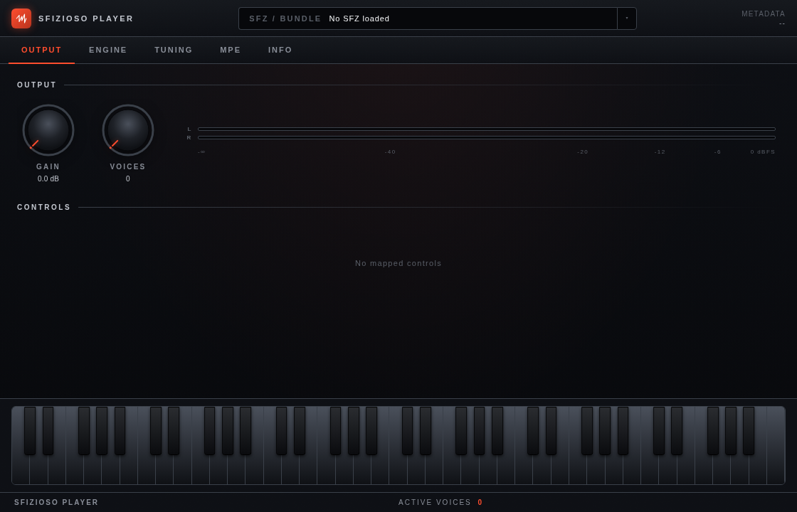

# Sfizioso Player

[](https://github.com/rullopat/sfizioso-player/actions/workflows/build.yml)

An open SFZ player (VST3 / AU / Standalone) and the shared foundation it is
built on, powered by the [sfizioso](https://github.com/rullopat/sfizioso) SFZ
engine — an independent, MPE-capable fork of sfizz.



## What's here

| Path | What | License |
|------|------|---------|
| `src/player_core/` | sfizioso engine wrapper (APVTS params, MIDI dispatch, render) | BSD-2-Clause |
| `src/core_prefs/`  | global user preference store (theme persistence) | BSD-2-Clause |
| `src/ui-shared/`   | React UI kit + C++/JS bridge (`juceBridge`, `useParam`, knobs, meters, design tokens) | BSD-2-Clause |
| `src/player/`      | the Sfizioso Player application (JUCE + React WebView editor) | AGPL-3.0 |

The shared libraries are permissive so they can also be consumed by other
projects (including closed-source ones); the application itself is AGPLv3.
See [LICENSE](LICENSE).

## MIDI Program Change

Incoming Program Change messages drive the loaded SFZ's existing global
`loprog` / `hiprog` region conditions. They do not load another SFZ file or
Player preset. With MPE disabled, Program Change from any MIDI channel updates
the global condition. With MPE Full enabled, MPE 1.0 Mode 3 rules apply: only
the Lower-Zone Manager Channel (MIDI channel 1) is accepted, and Program Change
on Member Channels is ignored.

## Build

```sh
git submodule update --init --recursive          # JUCE + sfizioso (and its nested deps)
cmake -B build -G Ninja -DCMAKE_BUILD_TYPE=Release
cmake --build build
ctest --test-dir build --output-on-failure       # player_core integration tests
```

`SFIZIOSO_PLAYER_TESTS` defaults to `ON` for top-level builds and `OFF` when
this repository is consumed through `add_subdirectory()`.

Node.js >= 20 is required for the WebView UI build. On Ubuntu 24.04, install
the native JUCE and WebKit dependencies with:

```sh
sudo apt install ninja-build libasound2-dev libfreetype-dev libfontconfig1-dev \
  libx11-dev libxcomposite-dev libxcursor-dev libxext-dev libxinerama-dev \
  libxrandr-dev libxrender-dev libwebkit2gtk-4.1-dev libglu1-mesa-dev \
  mesa-common-dev
```

On macOS, `brew install node ninja` installs the additional build tools.

Artefacts land under `build/SfiziosoPlayer_artefacts/`: VST3 and Standalone on
Linux and Windows, plus AU on macOS. Plugin builds are copied to the platform's
user plugin folder by default.

## Consuming the foundation

A parent CMake project can `add_subdirectory()` this repo to reuse the
libraries without building the application: when not the top-level project, the
JUCE / sfizioso submodules and the `SfiziosoPlayer` app target are skipped, and
only `player_core`, `core_prefs`, the `add_webview_ui()` helper, and the
`SFIZIOSO_UI_SHARED` path are exposed. The parent supplies JUCE + sfizioso.
